# DataSeer-Web


## Purposes

This repository corresponds to the DataSeer web application, which aims at driving the authors of scientific article/manuscripts to the best research data sharing practices, i.e. to ensure that the datasets coming with an article are associated with data availability statement, permanent identifiers and in general requirements regarding Open Science and reproducibility. 

Machine learning techniques are used to extract and structure the information of the scientific article, to identify contexts introducting datasets and finally to classify these context into predicted data types and subtypes. These ML predictions are used by the web application to help the authors to described in an efficient and assisted manner the datasets used in the article and how these data are shared with the scientific community. 

See the [dataseer-ml](https://github.com/dataseer/dataseer-ml) repository for the machine learning services used by DataSeer web.

Supported article formats are PDF, docx, TEI, JATS/NLM, ScholarOne, and a large variety of additional publisher native XML formats: BMJ, Elsevier staging format, OUP, PNAS, RSC, Sage, Wiley, etc (see [Pub2TEI](https://github.com/kermitt2/Pub2TEI) for the list of native publisher XML format covered).

## Implementation

MongoDB stores every documents.

Express is used as web framework.

## Contact and License

Main authors and contact: [Nicolas Kieffer](https://github.com/NicolasKieffer), Patrice Lopez (<patrice.lopez@science-miner.com>).

The development of dataseer-ml is supported by a [Sloan Foundation](https://sloan.org/) grant, see [here](https://coko.foundation/coko-receives-sloan-foundation-grant-to-build-dataseer-a-missing-piece-in-the-data-sharing-puzzle/).

dataseer-Web is distributed under [Apache2 license](https://www.apache.org/licenses/LICENSE-2.0).

## Install

``npm i``

## Run

``npm start``

## Dependencies

Application requires an instance of mongoDB running on port `27017`, with an `app` database (`conf/conf.json` to set complete URL).

## Structure of data (Models)

Data in this app are structured like below:

Note: all models have additionnal parmaters: `_id` and `__v`.

### Accounts

Structure of data:

```js
{
  // "username": { "type": String, "default": "" }  <- this property is handled by passport package
  // "hash": { "type": String, "default": "" }  <- this property is handled by passport package
  // "salt": { "type": String, "default": "" }  <- this property is handled by passport package
  "fullname": { "type": String, "default": "" },
  "role": { "type": mongoose.Schema.Types.ObjectId, "ref": "Roles", "required": true }, // refers to roles collection item
  "organisation": { "type": mongoose.Schema.Types.ObjectId, "ref": "Organisations", "required": true }, // refers to organisations collection item
  "tokens": { "api": { "type": String, "default": "" }, "resetPassword": { "type": String, "default": "" } } // tokens of user
}
```

### Organisations

Structure of data:

```js
{
  "name": { "type": String, "default": "None", "index": true } // name of organisation
}
```

### Roles

Structure of data:

```js
{
  "label": { "type": String, "default": "", "index": true }, // label of role
  "weight": { "type": Number, "default": 0 } // weight of role
}
```

### Documents

Structure of data:

```js
{
  "logs": [{ "type": mongoose.Schema.Types.ObjectId, "ref": "DocumentsLogs", "select": false }], // refers to documents.logs collection items
  "pdf": { "type": mongoose.Schema.Types.ObjectId, "ref": "DocumentsFiles" }, // refers to documents.files collection item (pdf)
  "tei": { "type": mongoose.Schema.Types.ObjectId, "ref": "DocumentsFiles" }, // refers to documents.files collection item (tei)
  "files": [{ "type": mongoose.Schema.Types.ObjectId, "ref": "DocumentsFiles" }], // refers to documents.files collection items (all kind of files)
  "metadata": { "type": mongoose.Schema.Types.ObjectId, "ref": "DocumentsMetadata" }, // refers to documents.metadata collection item
  "organisation": { "type": mongoose.Schema.Types.ObjectId, "ref": "Organisations" }, // refers to organisations collection item
  "datasets": { "type": mongoose.Schema.Types.ObjectId, "ref": "DocumentsDatasets" }, // refers to documents.datasets collection item
  "status": { "type": String, "default": "" }, // status of given document
  "isDataSeer": { "type": Boolean, "default": false }, // specify if it"s a dataseer document
  "updated_at": { "type": Date, "default": Date.now }, // date of last update
  "uploaded_at": { "type": Date, "default": Date.now }, // date of upload
  "uploaded_by": { "type": mongoose.Schema.Types.ObjectId, "ref": "Accounts" }, // refers to documents.datasets collection item
  "upload_journal": { "type": mongoose.Schema.Types.ObjectId, "ref": "Organisations" }, // Which journal will be sent to
  "already_assessed": { "type": Boolean, "default": false }, // This is a new version of an article DataSeer has already assessed
  "owner": { "type": mongoose.Schema.Types.ObjectId, "ref": "Accounts" }, // refers to documents.datasets collection item
  "watchers": [{ "type": mongoose.Schema.Types.ObjectId, "ref": "Accounts" }], // refers to documents.accounts collection item
  "token": { "type": String, "default": "" } // refers to documents.datasets collection item
}
```

#### Documents Metadata

Structure of data:

```js
// Authors
{ name: String, affiliations: [String] }, { _id: false }

// Metadata
{
  "document": { "type": mongoose.Schema.Types.ObjectId, ref: "Documents" }, // refers to documents collection (id of a given document)
  "article_title": { "type": String, "default": "" }, // articleTitle
  "journal": { "type": String, "default": "" }, // journal
  "publisher": { "type": String, "default": "" }, // publisher
  "date_published": { "type": String, "default": "" }, // date_published
  "manuscript_id": { "type": String, "default": "" }, // manuscriptId
  "submitting_author": { "type": String, "default": "" }, // submittingAuthor
  "submitting_author_email": { "type": String, "default": "" }, // submittingAuthorEmail
  "authors": [Author], // authors. Array(Object) => {"name": String, "affiliations": Array(String) }
  "doi": { "type": String, "default": "" }, // doi
  "pmid": { "type": String, "default": "" } // pmid
}
```

#### Documents Datasets

Structure of data:

```js
// Dataset
{
  "id": { "type": String, "default": "" }, // id
  "sentenceId": { "type": String, "default": "" }, // sentence id
  "cert": { "type": String, "default": "" }, // cert value (between 0 and 1)
  "dataType": { "type": String, "default": "" }, // dataType
  "subType": { "type": String, "default": "" }, //  subType
  "description": { "type": String, "default": "" }, // description
  "bestDataFormatForSharing": { "type": String, "default": "" }, // best data format for sharing
  "mostSuitableRepositories": { "type": String, "default": "" }, // most suitable repositories
  "DOI": { "type": String, "default": "" }, // DOI
  "name": { "type": String, "default": "" }, // name
  "comments": { "type": String, "default": "" }, // comments
  "text": { "type": String, "default": "" }, // text of sentence
  "status": { "type": String, "default": "saved" } // text of sentence
}

// Datasets
{
  "document": { "type": mongoose.Schema.Types.ObjectId, "ref": "Documents" }, // refers to documents collection (id of a given document)
  "deleted": [Dataset], // deleted datasets (Array of datasets)
  "extracted": [Dataset], // extracted datasets (Array of datasets)
  "current": [Dataset] // current datasets (Array of datasets)
}
```

#### Documents Files

Structure of data:

```js
{
  "document": { "type": mongoose.Schema.Types.ObjectId, "ref": "Documents" }, // refers to documents collection (id of a given document)
  "updated_at": { "type": Date, "default": Date.now }, // date of last update
  "uploaded_at": { "type": Date, "default": Date.now }, // date of upload
  "uploaded_by": { "type": mongoose.Schema.Types.ObjectId, "ref": "Accounts" }, // refers to documents.datasets collection item
  "metadata": { "type": Object, "default": {} }, // metadata of file (could be whatever you want, you have to handle it by yourself). Usefull for PDF processed by dataseer-ml
  "filename": { "type": String, "default": "" }, // filename of file
  "path": { "type": String, "default": "", select: false }, // path of file
  "encoding": { "type": String, "default": "" }, // encoding of file
  "md5": { "type": String, "default": "" }, // md5 of file
  "mimetype": { "type": String, "default": "" }, // mimetype of file
  "size": { "type": Number, "default": 0 } // size of file
}
```

#### Documents Logs

Structure of data:

```js
{
  "document": { "type": mongoose.Schema.Types.ObjectId, "ref": "Documents", "required": true }, // refers to documents collection (id of a given document)
  "user": { "type": mongoose.Schema.Types.ObjectId, "ref": "Accounts", "required": true }, // refers to accounts collection
  "action": { "type": String, "required": true }, // description of modification that has been made to the document
  "date": { "type": Date, "default": Date.now } // date of creation
}
```

## Configuration

### Web App

Web app [default configuration file](/conf/conf.default.json). You must create file conf/conf.json and fill it with data like below:

```json
{
  "services": {
    "mongodb": "mongodb://localhost:27017/app",
    "dataseer-ml": "http://localhost/dataseer-ml/service",
    "curator-email": "curator@mydomain.ai"
  },
  "emails": {
    "upload": "info@dataseer.ai"
  },
  "FileSystemRoot": "./data",
  "root": "http://localhost:3000/",
  "_reCAPTCHA_site_key_": {
    "public": "publicKey",
    "private": "privateKey"
  },
  "_reCAPTCHA_score_": {
    "limit": 0.75,
    "error": "Authentication failed (captcha score too low)"
  },
  "tokens": {
    "api": {
      "expiresIn": 2592000 // 60 days
    },
    "documents": {
      "expiresIn": 2592000, // 60 days
      "accountId": "Account ID that will be used for logs"
    },
    "resetPassword": {
      "expiresIn": 3600// 1 hour
    },
    "automaticAccountCreation": {
      "expiresIn": 604800 // 7 days
    }
  }
}
```

### SMTP

Application requires a SMTP server to send some emails (resest password, API token, automatique account creation)

SMTP [default configuration file](/conf/smtp.conf.default.json). You must create file conf/smtp.conf.json and fill it with data like below:

```json
{
  "host": "smtp.default.com",
  "port": 587,
  "auth": {
    "user": "user@default.com",
    "pass": "pass"
  },
  "from": "\"Fred Foo\" <foo@example.com>"
}
```

### JWT & private key

Application requires a private key to create JSON Web Token.

You must create file conf/private.key and fill it with a string.

## Description

The project provides: 

  - a web application to process documents stored in MongoDB database: `localhost:3000/`
  - a back office for uploading manually documents to be processed: `localhost:3000/backoffice/`
  - a REST api to load and modify documents data (CRUD): `localhost:3000/api`

##Documentations

  - [Web Application documentation](#web-application)
    - [Responses Status Codes](#response-status-codes)
    - [Credentials](#credentials)
    - [Results](#results)
    - [Routes](#routes)
  - [API documentation](#api)
    - [Responses Status Codes](#response-status-codes_1)
    - [Credentials](#credentials_1)
    - [Results](#results_1)
    - [Routes](#routes_1)
  
## Web Application

### Response status codes:

<table>
  <thead>
    <tr>
      <th>HTTP Status code</th>
      <th>Reason</th>
    </tr>
  </thead>
  <tbody>
    <tr>
      <td>200</td>
      <td>Successful operation</td>
    </tr>
    <tr>
      <td>401</td>
      <td>Access not granted</td>
    </tr>
    <tr>
      <td>404</td>
      <td>URL no found (route does not exist)</td>
    </tr>
    <tr>
      <td>500</td>
      <td>Internal service error</td>
    </tr>
  </tbody>
</table>

### Credentials

You must be logged (email & password) in to access most of the following routes.

Sign in (/signin) or Sign up (/signup) before using dataseer-web app.

__If you try to access an unauthorized route, the app will return an HTTP 401 error__

```
# HTTP 401 returned
Your current role do not grant access to this part of website
```

### Results

Web Application will return HTML Format response with HTTP 200.

### Routes

All these routes return a graphical interface (HTML format):

  - [/signup](#signup)
  - [/signin](#signin)
  - [/signout](#signout)
  - [/settings](#settings)
  - [/forgotPassword](#forgotpassword)
  - [/resetPassword](#resetpassword)
  - [/myDocuments](#mydocuments)
  - [/documents/:id](#documentsid)
  - [/upload](#upload)
  - [/documents](#documents)
  - [/accounts](#accounts)
  - [/organizations](#organizations)

---

#### /signup

##### Role required

This route is public.

##### GUI

Use it to sign up to dataseer-web service.

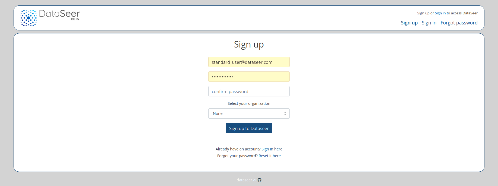

---

#### /signin

##### Role required

This route is public.

##### Purpose

Use it to sign in to dataseer-web service.

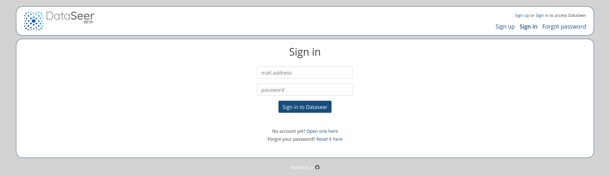

---

#### /signout

##### Role required

Accessible to users with the following role : **santard_user**, **annotator**, **curator**.

##### Purpose

Use it to sign out to dataseer-web service.

---

#### /settings

##### Role required

Accessible to users with the following role : **santard_user**, **annotator**, **curator**.

##### Purpose

Use it to reset your password (when you are logged in) or get your account infos.

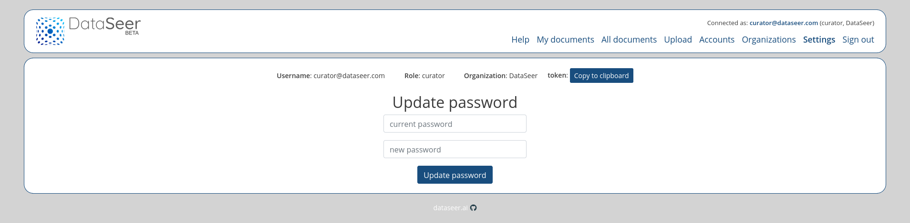

---

#### /forgotPassword

##### Role required

Accessible to users with the following role : **santard_user**, **annotator**, **curator**.

##### Purpose

Use it to get your password reset email when you are logged out.

*(An email containing all required informations will be sent to you)*

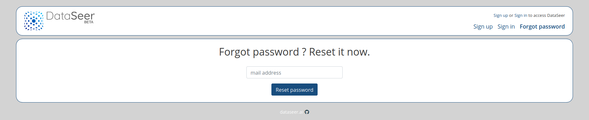

---

#### /resetPassword

##### Role required

Accessible to users with the following role : **santard_user**, **annotator**, **curator**.

##### Purpose

Use it to reset your password when you are logged out.

*(An email containing all required informations should have been sent to you)*

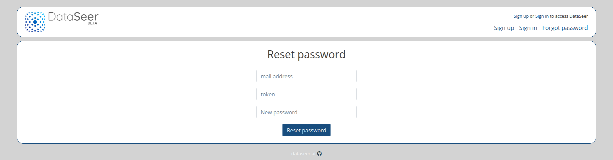

---

#### /myDocuments

##### Role required

Accessible to users with the following role : **santard_user**, **annotator**, **curator**.

##### Purpose

Use it to get your documents.

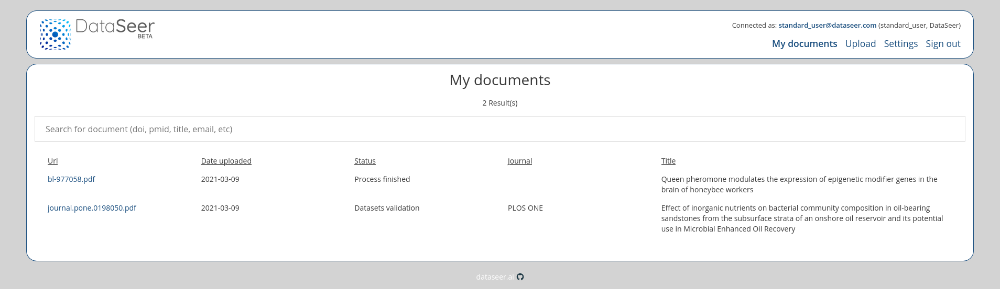

---

#### /documents/:id

##### Role required

Accessible to users with the following role : **santard_user**, **annotator**, **curator**.

Note: **santard_user**, **annotator**, **curator** do not have same restrictions & features available.

##### Purpose

Use it to get process a given document.

There is 3 steps while processing document:

---

###### metadata: metadata validation.

**santard_user**

On "metadata" step, you can validate metadata with button "Continue" to go to the next step (or contact a curator if nedded).

You can also share this document with button "Get public URL of this document". By using this URL, You will be considered as a "visitor" (a standard_user not logged in).

__Note:__ Public URL is like `http://localhost:3000/documents/60479f995e905b3e479e02e1?documentToken=...`


**annotator**, **curator**.

As curator or annotator, you can also reload metadata (useful after dataseer-ml service update/upgrade).


---

###### datasets: data entry of datasets.

On "datasets" step, PDF (or XML) is displayed in the GUI to enter the data relating to each datasets.

**santard_user**

Available actions:

  - "Add new Dataset" (you need to select sentence before)
  - "Delete" a given Dataset (click on trash icon)
  - "Link" sentence to an existing Dataset (click on trash icon of a Dataset)
  - "Save for later" a Dataset (click on chain icon of a Datset)
  - "Validate" a Dataset ("Name" & "DOI" are required)
  - "Metadata" Go back to "metadata" step
  - "Finish" Go to "finish" step (all Datasets must be validated)

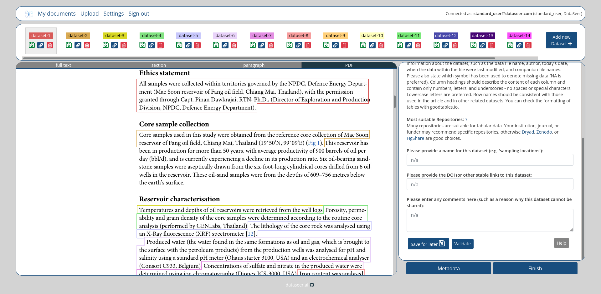

**annotator**, **curator**.

Available actions:

  - Same **santard_user** actions
  - "Refresh Datatypes" (useful after dataseer-ml service update/upgrade)
  - "Finish" Go to "finish" step without validate all Datasets

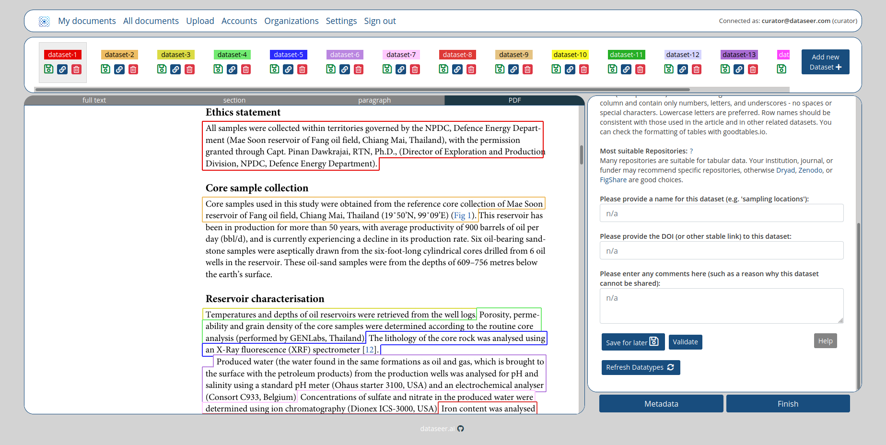

**Using public URL**

Same as **santard_user** (but you will be not considered as logged in).

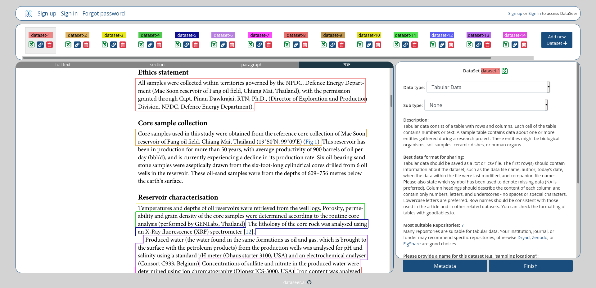

---

###### finish: report of data entered.

Accessible to users with the following role : **santard_user**, **annotator**, **curator**.

On "finish" step, summary of current state of document is shown. You can "Reopen document" to go back to "metadata" step and restart the process.

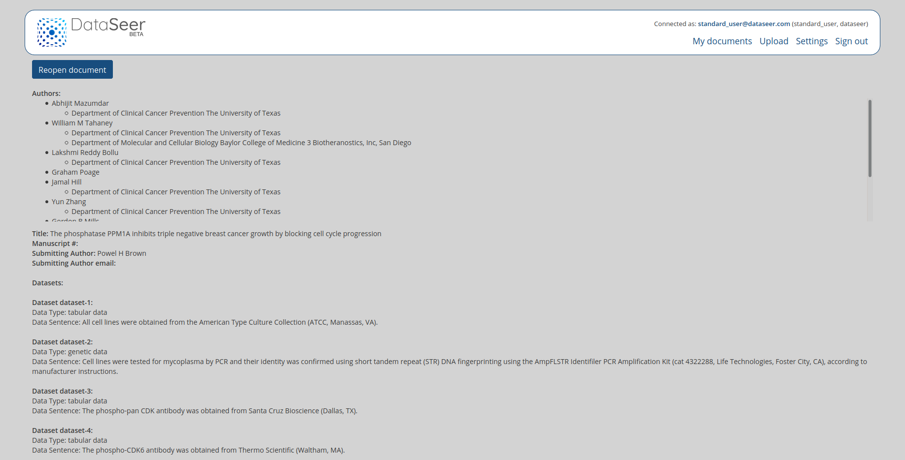

---

#### /upload

##### Role required

Accessible to users with the following role : **santard_user**, **annotator**, **curator**.

##### Purpose

Use it to upload a given document as **standard_user** or **annotator** (multiple documents if you are **curator**).

###### standard_user GUI

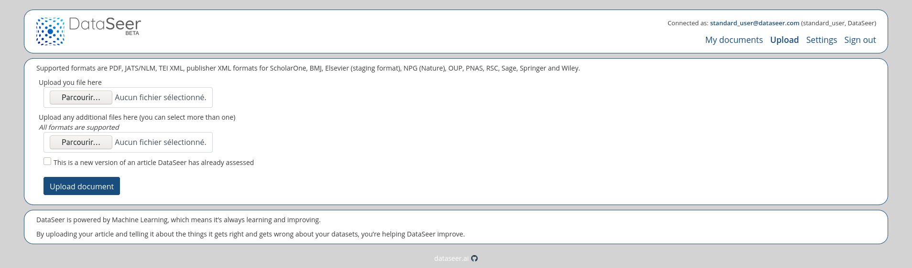

###### annotator & curator GUI

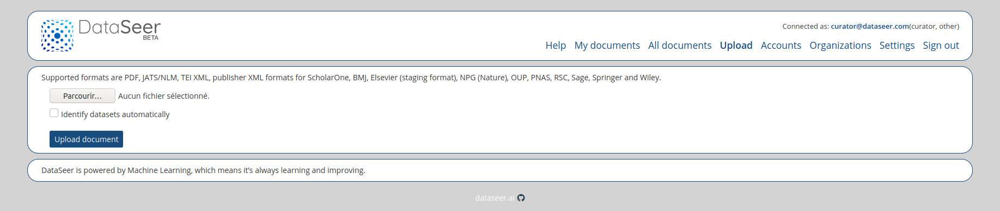

Note: **santard_user** or **annotator** will be redirected to uploaded document ("metadata" step), **curator** will get a report of all uploaded files.

---

#### /documents

##### Role required

Accessible to users with the following role : **annotator**, **curator**.

##### Purpose

Use it to get all documents.

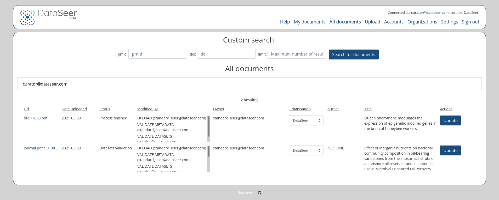

Note: **annotator** can only see documents of his organization, **curator** see all documents of all organizations.

---

#### /accounts

##### Role required

Accessible to users with the following role : **curator**.

##### Purpose

Use it to manage all accounts.

Use "New Token" button to send email (containing the token) to the user.


---

#### /organizations

##### Role required

Accessible to users with the following role : **curator**.

##### Purpose

Use it to manage all organizations.

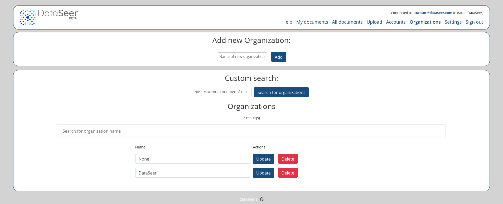

---

## API

### Response status codes:

<table>
  <thead>
    <tr>
      <th>HTTP Status code</th>
      <th>Reason</th>
    </tr>
  </thead>
  <tbody>
    <tr>
      <td>200</td>
      <td>Successful operation</td>
    </tr>
    <tr>
      <td>401</td>
      <td>Access not granted</td>
    </tr>
    <tr>
      <td>404</td>
      <td>URL no found (route does not exist)</td>
    </tr>
    <tr>
      <td>500</td>
      <td>Internal service error</td>
    </tr>
  </tbody>
</table>

### Credentials

You must use your API token to access all of the following routes.

Set your token into HTTP headers (Authorization: Bearer my).

```bash
# Replace MY_TOKEN by your dataseer-web API token
# use -H "Authorization: Bearer MY_TOKEN" to set headers with curl
$ curl "http://localhost:3000/api/documents/5ffa06e61c157616a5c6bae7" -H "Authorization: Bearer MY_TOKEN"
# Or use token parameter
$ curl "http://localhost:3000/api/documents/5ffa06e61c157616a5c6bae7?token=MY_TOKEN"
```

__If you try to access an unauthorized route, the app will return an HTTP 401 error__

```bash
# HTTP 401 will be returned
$ curl "http://localhost:3000/documents/5ffa06e61c157616a5c6bae7" -H "Authorization: Bearer WRONG_TOKEN"
# > Your current role do not grant access to this part of website
# This error is caused by: a wrong token, an expired token, a blacklisted token 
```

### Results

API will return JSON object response with HTTP 200.

#### Success

In case of success, API will return this kind of object:

```js
{
  "err": false,
  "res": {...}
}
// OR
{
  "err": false,
  "res": [{...}]
}
```

#### Error

```js
{
  "err": true,
  "res": null, // or false or undefined
  "msg": "A human-readable message describing the error that occurred"
}
```
 
### Routes

All these routes return a JSON object:

#### Documents

  - [(GET) /api/documents](#get-apidocuments)
  - [(POST) /api/documents](#post-apidocuments)
  - [(GET) /api/documents/:id](#get-apidocumentsid)
  - [(GET) /api/documents/:id/pdf](#get-apidocumentsidpdf)
  - [(GET) /api/documents/:id/pdf/content](#get-apidocumentsidpdfcontent)
  - [(GET) /api/documents/:id/tei/](#get-apidocumentsidtei)
  - [(GET) /api/documents/:id/tei/content](#get-apidocumentsidteicontent)
  - [(GET) /api/documents/:id/metadata](#get-apidocumentsidmetadata)
  - [(POST) /api/documents/:id/metadata/validate](#post-apidocumentsidmetadatavalidate)
  - [(GET) /api/documents/:id/datasets](#get-apidocumentsiddatasets)
  - [(POST) /api/documents/:id/datasets/validate](#post-apidocumentsiddatasetsvalidate)
  - [(POST) /api/documents/:id/datasets/backToMetadata](#post-apidocumentsiddatasetsbacktometadata)
  - [(POST) /api/documents/:id/finish/reopen](#post-apidocumentsidfinishreopen)
  - [(GET) /api/documents/:id/files](#get-apidocumentsidfiles)

#### Files

  - [(GET) /api/files/:id](#get-apifilesid)
  - [(GET) /api/files/:id/buffer](#get-apifilesidbuffer)
  - [(GET) /api/files/:id/string](#get-apifilesidstring)

#### Datasets

  - [(PUT) /api/datasets/:id](#put-apidatasetsid)
  - [(POST) /api/datasets/:id/checkValidation](#post-apidatasetsidcheckvalidation)
  - [(POST) /api/datasets/:id/dataset](#post-apidatasetsiddataset)
  - [(PUT) /api/datasets/:id/dataset](#put-apidatasetsiddataset)
  - [(DELETE) /api/datasets/:id/dataset](#delete-apidatasetsiddataset)
  - [(POST) /api/datasets/:id/corresp](#post-apidatasetsidcorresp)
  - [(DELETE) /api/datasets/:id/corresp](#delete-apidatasetsidcorresp)

#### DataSeerML

  - [(POST) /api/dataseer-ml/processDataseerSentence](#post-apidataseer-mlprocessdataseersentence)
  - [(GET) /api/dataseer-ml/jsonDataTypes](#get-apidataseer-mljsondatatypes)
  - [(GET) /api/dataseer-ml/resyncJsonDataTypes](#get-apidataseer-mlresyncjsondatatypes)

---

#### (GET) /api/documents

##### Description

This route return all documents.

##### Role required

Accessible to users with the following role : **santard_user**, **annotator**, **curator**.

##### Parameters

<table>
  <thead>
    <tr>
      <th>Method</th>
      <th>Request type</th>
      <th>Response type</th>
      <th>Parameters</th>
      <th>Requirement</th>
      <th>Description</th>
    </tr>
  </thead>
  <tbody>
    <tr>
      <td>GET</td>
      <td>application/x-www-form-urlencoded</td>
      <td>application/json</td>
      <td>limit</td>
      <td>optional</td>
      <td>Maximum number of returned results (default:20)</td>
    </tr>
    <tr>
      <td>GET</td>
      <td>application/x-www-form-urlencoded</td>
      <td>application/json</td>
      <td>skip</td>
      <td>optional</td>
      <td>Number of documents skipped (default:0)</td>
    </tr>
    <tr>
      <td>GET</td>
      <td>application/x-www-form-urlencoded</td>
      <td>application/json</td>
      <td>pdf</td>
      <td>optional</td>
      <td>If this parameter is set document.pdf will be filled with data.<br/>Else this property will only contain an id.</td>
    </tr>
    <tr>
      <td>GET</td>
      <td>application/x-www-form-urlencoded</td>
      <td>application/json</td>
      <td>tei</td>
      <td>optional</td>
      <td>If this parameter is set document.tei will be filled with data.<br/>Else this property will only contain an id.</td>
    </tr>
    <tr>
      <td>GET</td>
      <td>application/x-www-form-urlencoded</td>
      <td>application/json</td>
      <td>files</td>
      <td>optional</td>
      <td>If this parameter is set document.files will be filled with data.<br/>Else this property will only contain an id.</td>
    </tr>
    <tr>
      <td>GET</td>
      <td>application/x-www-form-urlencoded</td>
      <td>application/json</td>
      <td>metadata</td>
      <td>optional</td>
      <td>If this parameter is set document.metadata will be filled with data.<br/>Else this property will only contain an id.</td>
    </tr>
    <tr>
      <td>GET</td>
      <td>application/x-www-form-urlencoded</td>
      <td>application/json</td>
      <td>datasets</td>
      <td>optional</td>
      <td>If this parameter is set document.datasets will be filled with data.<br/>Else this property will only contain an id.</td>
    </tr>
  </tbody>
</table>

##### How to request

```bash
# Will return the 30 first documents
curl "http://localhost:3000/api/documents?limit=30" -H "Authorization: Bearer MY_TOKEN"
curl "http://localhost:3000/api/documents?limit=30&token=MY_TOKEN"
# Will return from the 10th to the 40th first documents
curl "http://localhost:3000/api/documents?limit=30&skip=10" -H "Authorization: Bearer MY_TOKEN"
curl "http://localhost:3000/api/documents?limit=30&skip=10&token=MY_TOKEN"
# Will return the 20 first documents with data filled for properties: pdf, tei, files, metadata, datasets
curl "http://localhost:3000/api/documents/?pdf=true&tei=true&files=true&metadata=true&datasets=true" -H "Authorization: Bearer MY_TOKEN"
curl "http://localhost:3000/api/documents/?pdf=true&tei=true&files=true&metadata=true&datasets=true&token=MY_TOKEN"
```

##### Result

```js
{
  "err": false,
  "res": [{...}, {...}] // Array of documents
}
```

---

#### (POST) /api/documents

##### Description

This route add new a document (should be used to upload document).

##### Role required

Accessible to users with the following role : **curator**.

##### Parameters

<table>
  <thead>
    <tr>
      <th>Method</th>
      <th>Request type</th>
      <th>Response type</th>
      <th>Parameters</th>
      <th>Requirement</th>
      <th>Description</th>
    </tr>
  </thead>
  <tbody>
    <tr>
      <td>POST</td>
      <td>application/x-www-form-urlencoded</td>
      <td>application/json</td>
      <td>file</td>
      <td>required</td>
      <td>File of document<br/><i>Supported formats are PDF, JATS/NLM, TEI XML, publisher XML formats for ScholarOne, BMJ, Elsevier (staging format), NPG (Nature), OUP, PNAS, RSC, Sage, Springer and Wiley</i></td>
    </tr>
    <tr>
      <td>POST</td>
      <td>application/x-www-form-urlencoded</td>
      <td>application/json</td>
      <td>attachedFiles</td>
      <td>optional</td>
      <td>Files attached to document<br/><i>All formats are supported</i></td>
    </tr>
    <tr>
      <td>POST</td>
      <td>application/x-www-form-urlencoded</td>
      <td>application/json</td>
      <td>journal</td>
      <td>required</td>
      <td>Which journal this document will be sent to</td>
    </tr>
    <tr>
      <td>POST</td>
      <td>application/x-www-form-urlencoded</td>
      <td>application/json</td>
      <td>email</td>
      <td>required</td>
      <td>Email of document owner</td>
    </tr>
    <tr>
      <td>POST</td>
      <td>application/x-www-form-urlencoded</td>
      <td>application/json</td>
      <td>fullname</td>
      <td>required</td>
      <td>Fullname of document owner</td>
    </tr>
    <tr>
      <td>POST</td>
      <td>application/x-www-form-urlencoded</td>
      <td>application/json</td>
      <td>dataseerML</td>
      <td>optional</td>
      <td>Specify if dataseer-ml will process this document (default: false, but should be set to true)</td>
    </tr>
    <tr>
      <td>POST</td>
      <td>application/x-www-form-urlencoded</td>
      <td>application/json</td>
      <td>already_assessed</td>
      <td>optional</td>
      <td>Specify if this document has been already assessed (default: false)</td>
    </tr>
    <tr>
      <td>POST</td>
      <td>application/x-www-form-urlencoded</td>
      <td>application/json</td>
      <td>isDataseer</td>
      <td>optional</td>
      <td>Specify if this document is from DataSeer (default: false)</td>
    </tr>
    <tr>
      <td>POST</td>
      <td>application/x-www-form-urlencoded</td>
      <td>application/json</td>
      <td>mute</td>
      <td>optional</td>
      <td>Specify if notifications will be sent (default: true)</td>
    </tr>
  </tbody>
</table>

##### How to request

```bash
# Upload a document with attached files
curl -X "POST" -F "file=@/path/to/file.pdf" -F "attached_files[]=@/path/to/file.xml" -F "attached_files[]=@/path/to/file.png" -F "journal=journal" -F "email=email@email.com" -F "fullname=Full Name" -F "dataseerML=true" -H "Authorization: Bearer MY_TOKEN" "http://localhost:3000/api/documents"
curl -X "POST" -F "file=@/path/to/file.pdf" -F "attached_files[]=@/path/to/file.xml" -F "attached_files[]=@/path/to/file.png" -F "journal=journal" -F "email=email@email.com" -F "fullname=Full Name" -F "dataseerML=true" "http://localhost:3000/api/documents?token=MY_TOKEN"

# Upload a document without attached files
curl -X "POST" -F "file=@/path/to/file.pdf" -F "journal=journal" -F "email=email@email.com" -F "fullname=Full Name" -F "dataseerML=true" -H "Authorization: Bearer MY_TOKEN" "http://localhost:3000/api/documents"
curl -X "POST" -F "file=@/path/to/file.pdf" -F "journal=journal" -F "email=email@email.com" -F "fullname=Full Name" -F "dataseerML=true" "http://localhost:3000/api/documents?token=MY_TOKEN"

# Upload a document with attached files but do not send email notification
curl -X "POST" -F "file=@/path/to/file.pdf" -F "attached_files[]=@/path/to/file.xml" -F "attached_files[]=@/path/to/file.png" -F "journal=journal" -F "email=email@email.com" -F "fullname=Full Name" -F "dataseerML=true" -F "mute=true" -H "Authorization: Bearer MY_TOKEN" "http://localhost:3000/api/documents"
curl -X "POST" -F "file=@/path/to/file.pdf" -F "attached_files[]=@/path/to/file.xml" -F "attached_files[]=@/path/to/file.png" -F "journal=journal" -F "email=email@email.com" -F "fullname=Full Name" -F "dataseerML=true" -F "mute=true" "http://localhost:3000/api/documents?token=MY_TOKEN"
```

##### Result

```js
{
  "err": false,
  "res": {...} // uploaded document
}
```

---

#### (GET) /api/documents/:id

##### Description

This route return the document with the given id.

##### Role required

Accessible to users with the following role : **santard_user**, **annotator**, **curator**.

##### Parameters

<table>
  <thead>
    <tr>
      <th>Method</th>
      <th>Request type</th>
      <th>Response type</th>
      <th>Parameters</th>
      <th>Requirement</th>
      <th>Description</th>
    </tr>
  </thead>
  <tbody>
    <tr>
      <td>GET</td>
      <td>application/x-www-form-urlencoded</td>
      <td>application/json</td>
      <td>limit</td>
      <td>optional</td>
      <td>Maximum number of returned results (default:20)</td>
    </tr>
    <tr>
      <td>GET</td>
      <td>application/x-www-form-urlencoded</td>
      <td>application/json</td>
      <td>skip</td>
      <td>optional</td>
      <td>Number of documents skipped (default:0)</td>
    </tr>
    <tr>
      <td>GET</td>
      <td>application/x-www-form-urlencoded</td>
      <td>application/json</td>
      <td>pdf</td>
      <td>optional</td>
      <td>If this parameter is set document.pdf will be filled with data.<br/>Else this property will only contain an id.</td>
    </tr>
    <tr>
      <td>GET</td>
      <td>application/x-www-form-urlencoded</td>
      <td>application/json</td>
      <td>tei</td>
      <td>optional</td>
      <td>If this parameter is set document.tei will be filled with data.<br/>Else this property will only contain an id.</td>
    </tr>
    <tr>
      <td>GET</td>
      <td>application/x-www-form-urlencoded</td>
      <td>application/json</td>
      <td>files</td>
      <td>optional</td>
      <td>If this parameter is set document.files will be filled with data.<br/>Else this property will only contain an id.</td>
    </tr>
    <tr>
      <td>GET</td>
      <td>application/x-www-form-urlencoded</td>
      <td>application/json</td>
      <td>metadata</td>
      <td>optional</td>
      <td>If this parameter is set document.metadata will be filled with data.<br/>Else this property will only contain an id.</td>
    </tr>
    <tr>
      <td>GET</td>
      <td>application/x-www-form-urlencoded</td>
      <td>application/json</td>
      <td>datasets</td>
      <td>optional</td>
      <td>If this parameter is set document.datasets will be filled with data.<br/>Else this property will only contain an id.</td>
    </tr>
  </tbody>
</table>

##### How to request

###### Get "light version" of a given document

```bash
# Will return document (with id 60479f995e905b3e479e02e1) without data for: pdf, tei, files, metadata, datasets
curl "http://localhost:3000/api/documents/60479f995e905b3e479e02e1" -H "Authorization: Bearer MY_TOKEN"
curl "http://localhost:3000/api/documents/60479f995e905b3e479e02e1?token=MY_TOKEN"
```

```js
{
  "err": false,
  "res": {
    "logs": [
      "60479fa55e905b3e479e02e6",
      "60479fe25e905b3e479e02e7",
      "6047a07c5e905b3e479e02e8",
      "6047a1cd5e905b3e479e02e9",
      "6047a1d25e905b3e479e02ea",
      "6047bb7a5e905b3e479e02eb"
    ],
    "files": [
      "60479f995e905b3e479e02e2",
      "60479fa55e905b3e479e02e3"
    ],
    "status": "metadata",
    "isDataSeer": false,
    "already_assessed": false,
    "watchers": [
      "5e2f6afe0bb7cd4cdfba9f03",
      "5e2f6b4c0bb7cd4cdfba9f05",
      "603fd834d56f3907b75dcbe0"
    ],
    "token": "eyJhbGciOi...VtcnaB4eTQ",
    "_id": "60479f995e905b3e479e02e1",
    "uploaded_by": "5e2f6afe0bb7cd4cdfba9f03",
    "updated_at": "2021-03-09T16:17:29.556Z",
    "uploaded_at": "2021-03-09T16:17:29.556Z",
    "__v": 9,
    "metadata": "60479fa55e905b3e479e02e4",
    "organisation": "60344b86aae2c62a0769d44a",
    "owner": "5e2f6afe0bb7cd4cdfba9f03",
    "pdf": "60479f995e905b3e479e02e2",
    "tei": "60479fa55e905b3e479e02e3",
    "upload_journal": "60344b86aae2c62a0769d44a",
    "datasets": "60479fa55e905b3e479e02e5"
  }
}
```


###### Get "full version" of a given document

```bash
# Will return document (with id 60479f995e905b3e479e02e1) with data filled for properties: pdf, tei, files, metadata, datasets
curl "http://localhost:3000/api/documents/60479f995e905b3e479e02e1?pdf=true&tei=true&files=true&metadata=true&datasets=true" -H "Authorization: Bearer MY_TOKEN"
curl "http://localhost:3000/api/documents/60479f995e905b3e479e02e1?pdf=true&tei=true&files=true&metadata=true&datasets=true&token=MY_TOKEN"
```

```js
{
  "err": false,
  "res": {
    "logs": [
      "60479fa55e905b3e479e02e6",
      "60479fe25e905b3e479e02e7",
      "6047a07c5e905b3e479e02e8",
      "6047a1cd5e905b3e479e02e9",
      "6047a1d25e905b3e479e02ea",
      "6047bb7a5e905b3e479e02eb"
    ],
    "files": [{...},{...}],
    "status": "metadata",
    "isDataSeer": false,
    "already_assessed": false,
    "watchers": [
      "5e2f6afe0bb7cd4cdfba9f03",
      "5e2f6b4c0bb7cd4cdfba9f05",
      "603fd834d56f3907b75dcbe0"
    ],
    "token": "eyJhbGciOi...VtcnaB4eTQ",
    "_id": "60479f995e905b3e479e02e1",
    "uploaded_by": "5e2f6afe0bb7cd4cdfba9f03",
    "updated_at": "2021-03-09T16:17:29.556Z",
    "uploaded_at": "2021-03-09T16:17:29.556Z",
    "__v": 9,
    "metadata": {...},
    "organisation": "60344b86aae2c62a0769d44a",
    "owner": "5e2f6afe0bb7cd4cdfba9f03",
    "pdf": {...},
    "tei": {...},
    "upload_journal": "60344b86aae2c62a0769d44a",
    "datasets": {
      "_id": "60479fa55e905b3e479e02e5",
      "document": "60479f995e905b3e479e02e1",
      "extracted": [{...}],
      "current": [{...}],
      "deleted":  [{...}],
      "__v": 0
    }
  }
}
```

##### Result

```js
{
  "err": false,
  "res": {...} // given document
}
```

---

#### (GET) /api/documents/:id/pdf

##### Description

This route return the pdf (JSON format) of given documents.

##### Role required

Accessible to users with the following role : **santard_user**, **annotator**, **curator**.

##### Parameters

No parameters available

##### How to request

```bash
# Will return the pdf (JSON format) of the document (with id 60479f995e905b3e479e02e1)
curl "http://localhost:3000/api/documents/60479f995e905b3e479e02e1/pdf" -H "Authorization: Bearer MY_TOKEN"
curl "http://localhost:3000/api/documents/60479f995e905b3e479e02e1/pdf?token=MY_TOKEN"
```

##### Result

```js
{
  "err": false,
  "res": {...} // pdf data of the document (see models section to get more infos)
}
```

---

#### (GET) /api/documents/:id/pdf/content

##### Description

This route return the pdf (binary file) of given documents.

##### Role required

Accessible to users with the following role : **santard_user**, **annotator**, **curator**.

##### Parameters

No parameters available

##### How to request

```bash
# Will return the pdf (binary file) of the document (with id 60479f995e905b3e479e02e1)
curl "http://localhost:3000/api/documents/60479f995e905b3e479e02e1/pdf/content" -H "Authorization: Bearer MY_TOKEN"
curl "http://localhost:3000/api/documents/60479f995e905b3e479e02e1/pdf/content?token=MY_TOKEN"
```

##### Result

```
Binary file

```

---

#### (GET) /api/documents/:id/tei

##### Description

This route return the tei (JSON format) of given documents.

##### Role required

Accessible to users with the following role : **santard_user**, **annotator**, **curator**.

##### Parameters

No parameters available

##### How to request

```bash
# Will return the tei (JSON format) of the document (with id 60479f995e905b3e479e02e1)
curl "http://localhost:3000/api/documents/60479f995e905b3e479e02e1/tei" -H "Authorization: Bearer MY_TOKEN"
curl "http://localhost:3000/api/documents/60479f995e905b3e479e02e1/tei?token=MY_TOKEN"
```

##### Result

```js
{
  "err": false,
  "res": {...} // tei data of the document (see models section to get more infos)
}
```

---

#### (GET) /api/documents/:id/tei/content

##### Description

This route return the tei (binary file) of given documents.

##### Role required

Accessible to users with the following role : **santard_user**, **annotator**, **curator**.

##### Parameters

No parameters available

##### How to request

```bash
# Will return the tei (binary file) of the document (with id 60479f995e905b3e479e02e1)
curl "http://localhost:3000/api/documents/60479f995e905b3e479e02e1/tei/content" -H "Authorization: Bearer MY_TOKEN"
curl "http://localhost:3000/api/documents/60479f995e905b3e479e02e1/tei/content?token=MY_TOKEN"
```

##### Result

```
Binary file

```

---

#### (GET) /api/documents/:id/metadata

##### Description

This route return the metadata (JSON formated) of given documents.

##### Role required

Accessible to users with the following role : **santard_user**, **annotator**, **curator**.

##### Parameters

No parameters available

##### How to request

```bash
# Will return the metadata (JSON formated) of the document (with id 60479f995e905b3e479e02e1)
curl "http://localhost:3000/api/documents/60479f995e905b3e479e02e1/metadata" -H "Authorization: Bearer MY_TOKEN"
curl "http://localhost:3000/api/documents/60479f995e905b3e479e02e1/metadata?token=MY_TOKEN"
```

##### Result

```js
{
  "err": false,
  "res": {...} // metadata of the document (see models section to get more infos)
}
```

---

#### (POST) /api/documents/:id/metadata/validate

##### Description

This route validate the "metadata" step of the given documents.

##### Role required

Accessible to users with the following role : **santard_user**, **annotator**, **curator**.

##### Parameters

No parameters available

##### How to request

```bash
# Will validate the "metadata" step of the document (with id 60479f995e905b3e479e02e1)
curl -X "POST" "http://localhost:3000/api/documents/60479f995e905b3e479e02e1/metadata/validate" -H "Authorization: Bearer MY_TOKEN"
curl -X "POST" "http://localhost:3000/api/documents/60479f995e905b3e479e02e1/metadata/validate?token=MY_TOKEN"
```

##### Result

```js
{
  "err": false,
  "res": true
}
```

---

#### (GET) /api/documents/:id/datasets

##### Description

This route return the datasets (JSON formated) of given documents.

##### Role required

Accessible to users with the following role : **santard_user**, **annotator**, **curator**.

##### Parameters

No parameters available

##### How to request

```bash
# Will return the datasets (JSON formated) of the document (with id 60479f995e905b3e479e02e1)
curl "http://localhost:3000/api/documents/60479f995e905b3e479e02e1/datasets" -H "Authorization: Bearer MY_TOKEN"
curl "http://localhost:3000/api/documents/60479f995e905b3e479e02e1/datasets?token=MY_TOKEN"
```

##### Result

```js
{
  "err": false,
  "res": {...} // datasets of the document (see models section to get more infos)
}
```

---

#### (POST) /api/documents/:id/datasets/validate

##### Description

This route validate the "datasets" step of the given documents.

##### Role required

Accessible to users with the following role : **santard_user**, **annotator**, **curator**.

##### Parameters

No parameters available

##### How to request

```bash
# Will validate the "datasets" step of the document (with id 60479f995e905b3e479e02e1)
curl -X "POST" "http://localhost:3000/api/documents/60479f995e905b3e479e02e1/datasets/validate" -H "Authorization: Bearer MY_TOKEN"
curl -X "POST" "http://localhost:3000/api/documents/60479f995e905b3e479e02e1/datasets/validate?token=MY_TOKEN"
```

##### Result

```js
{
  "err": false,
  "res": true
}
```

---

#### (POST) /api/documents/:id/datasets/backToMetadata

##### Description

This route return the given document to the "metadata" step.

##### Role required

Accessible to users with the following role : **santard_user**, **annotator**, **curator**.

##### Parameters

No parameters available

##### How to request

```bash
# Will return the given document (with id 60479f995e905b3e479e02e1) to the "metadata" step
curl -X "POST" "http://localhost:3000/api/documents/60479f995e905b3e479e02e1/datasets/validate" -H "Authorization: Bearer MY_TOKEN"
curl -X "POST" "http://localhost:3000/api/documents/60479f995e905b3e479e02e1/datasets/validate?token=MY_TOKEN"
```

##### Result

```js
{
  "err": false,
  "res": true
}
```

---

#### (POST) /api/documents/:id/finish/reopen

##### Description

This route return the given document to the "metadata" step.

##### Role required

Accessible to users with the following role : **santard_user**, **annotator**, **curator**.

##### Parameters

No parameters available

##### How to request

```bash
# Will return the given document (with id 60479f995e905b3e479e02e1) to the "metadata" step
curl -X "POST" "http://localhost:3000/api/documents/60479f995e905b3e479e02e1/finish/reopen" -H "Authorization: Bearer MY_TOKEN"
curl -X "POST" "http://localhost:3000/api/documents/60479f995e905b3e479e02e1/finish/reopen?token=MY_TOKEN"
```

##### Result

```js
{
  "err": false,
  "res": true
}
```

---

#### (GET) /api/documents/:id/files

##### Description

This route return all files (JSON formated) of given documents.

##### Role required

Accessible to users with the following role : **santard_user**, **annotator**, **curator**.

##### Parameters

No parameters available

##### How to request

```bash
# Will return all files (JSON formated) of the document (with id 60479f995e905b3e479e02e1)
curl "http://localhost:3000/api/documents/60479f995e905b3e479e02e1/files" -H "Authorization: Bearer MY_TOKEN"
curl "http://localhost:3000/api/documents/60479f995e905b3e479e02e1/files?token=MY_TOKEN"
```

##### Result

```js
{
  "err": false,
  "res": [{...}] // Array of file JSON representation (see models section to get more infos)
}
```

---

#### (GET) /api/files/:id

##### Description

This route return a given file (JSON formated).

##### Role required

Accessible to users with the following role : **santard_user**, **annotator**, **curator**.

##### Parameters

No parameters available

##### How to request

```bash
# Will return the files (JSON formated) with id 60479f995e905b3e479e02e1
curl "http://localhost:3000/api/files/60479f995e905b3e479e02e1/files" -H "Authorization: Bearer MY_TOKEN"
curl "http://localhost:3000/api/files/60479f995e905b3e479e02e1/files?token=MY_TOKEN"
```

##### Result

```js
{
  "err": false,
  "res": {...} // file JSON representation (see models section to get more infos)
}
```

---

#### (GET) /api/files/:id/buffer

##### Description

This route return a given file (Buffer formated).

##### Role required

Accessible to users with the following role : **santard_user**, **annotator**, **curator**.

##### Parameters

No parameters available

##### How to request

```bash
# Will return the files (Buffer formated) with id 60479f995e905b3e479e02e1
curl "http://localhost:3000/api/files/60479f995e905b3e479e02e1/files/buffer" -H "Authorization: Bearer MY_TOKEN"
curl "http://localhost:3000/api/files/60479f995e905b3e479e02e1/files/buffer?token=MY_TOKEN"
```

##### Result

```
Buffer
```

---

#### (GET) /api/files/:id/string

##### Description

This route return a given file (String formated).

##### Role required

Accessible to users with the following role : **santard_user**, **annotator**, **curator**.

##### Parameters

No parameters available

##### How to request

```bash
# Will return the files (String formated) with id 60479f995e905b3e479e02e1
curl "http://localhost:3000/api/files/60479f995e905b3e479e02e1/files/string" -H "Authorization: Bearer MY_TOKEN"
curl "http://localhost:3000/api/files/60479f995e905b3e479e02e1/files/string?token=MY_TOKEN"
```

##### Result

```
UTF-8 String
```

---

#### (PUT) /api/datasets/:id

##### Description

This route update diven datasets.

##### Role required

Accessible to users with the following role : **curator**.

##### Parameters

<table>
  <thead>
    <tr>
      <th>Method</th>
      <th>Request type</th>
      <th>Response type</th>
      <th>Parameters</th>
      <th>Requirement</th>
      <th>Description</th>
    </tr>
  </thead>
  <tbody>
    <tr>
      <td>POST</td>
      <td>application/x-www-form-urlencoded</td>
      <td>application/json</td>
      <td>current</td>
      <td>optional</td>
      <td>current datasets infos (see Models to get mores infos)</td>
    </tr>
    <tr>
      <td>POST</td>
      <td>application/x-www-form-urlencoded</td>
      <td>application/json</td>
      <td>deleted</td>
      <td>optional</td>
      <td>deleted datasets infos (see Models to get mores infos)</td>
    </tr>
    <tr>
      <td>POST</td>
      <td>application/x-www-form-urlencoded</td>
      <td>application/json</td>
      <td>extracted</td>
      <td>optional</td>
      <td>extracted datasets infos (see Models to get mores infos)</td>
    </tr>
  </tbody>
</table>

##### How to request

```bash
# Will update extracted property of datasets with id 60479f995e905b3e479e02e1
curl -X "PUT" -F "extracted=[{...}]" "http://localhost:3000/api/datasets/60479f995e905b3e479e02e1" -H "Authorization: Bearer MY_TOKEN"
curl -X "PUT" -F "extracted=[{...}]" "http://localhost:3000/api/datasets/60479f995e905b3e479e02e1?token=MY_TOKEN"
```

##### Result

```js
{
  "err": false,
  "res": true
}
```

---

#### (POST) /api/datasets/:id/checkValidation

##### Description

Check validation of all current datasets.

##### Role required

Accessible to users with the following role : **santard_user**, **annotator**, **curator**.

##### Parameters

No parameters available

##### How to request

```bash
# Will check validation of all current datasets with id 60479f995e905b3e479e02e1
curl -X "POST" "http://localhost:3000/api/datasets/60479f995e905b3e479e02e1/checkValidation" -H "Authorization: Bearer MY_TOKEN"
curl -X "POST" "http://localhost:3000/api/datasets/60479f995e905b3e479e02e1/checkValidation?token=MY_TOKEN"
```

##### Result

```js
{
  "err": false,
  "res": true // or false if validation failed
}
```

---

#### (POST) /api/datasets/:id/dataset

##### Description

Add new dataset to datasets with given id.

##### Role required

Accessible to users with the following role : **santard_user**, **annotator**, **curator**.

##### Parameters

<table>
  <thead>
    <tr>
      <th>Method</th>
      <th>Request type</th>
      <th>Response type</th>
      <th>Parameters</th>
      <th>Requirement</th>
      <th>Description</th>
    </tr>
  </thead>
  <tbody>
    <tr>
      <td>POST</td>
      <td>application/x-www-form-urlencoded</td>
      <td>application/json</td>
      <td>dataset</td>
      <td>optional</td>
      <td>new dataset (see Models to get mores infos)</td>
    </tr>
  </tbody>
</table>

##### How to request

```bash
# Will add new dataset to datasets with id 60479f995e905b3e479e02e1
curl -X "POST" -F "dataset={...}" "http://localhost:3000/api/datasets/60479f995e905b3e479e02e1/dataset" -H "Authorization: Bearer MY_TOKEN"
curl -X "POST" -F "dataset={...}" "http://localhost:3000/api/datasets/60479f995e905b3e479e02e1/dataset?token=MY_TOKEN"
```

##### Result

```js
{
  "err": false,
  "res": true
}
```

---

#### (PUT) /api/datasets/:id/dataset

##### Description

Update given dataset of datasets with given id.

##### Role required

Accessible to users with the following role : **santard_user**, **annotator**, **curator**.

##### Parameters

<table>
  <thead>
    <tr>
      <th>Method</th>
      <th>Request type</th>
      <th>Response type</th>
      <th>Parameters</th>
      <th>Requirement</th>
      <th>Description</th>
    </tr>
  </thead>
  <tbody>
    <tr>
      <td>PUT</td>
      <td>application/x-www-form-urlencoded</td>
      <td>application/json</td>
      <td>dataset</td>
      <td>optional</td>
      <td>updated dataset (see Models to get mores infos)</td>
    </tr>
  </tbody>
</table>

##### How to request

```bash
# Will add update given dataset of datasets with id 60479f995e905b3e479e02e1
curl -X "PUT" -F "dataset={...}" "http://localhost:3000/api/datasets/60479f995e905b3e479e02e1/dataset" -H "Authorization: Bearer MY_TOKEN"
curl -X "PUT" -F "dataset={...}" "http://localhost:3000/api/datasets/60479f995e905b3e479e02e1/dataset?token=MY_TOKEN"
```

##### Result

```js
{
  "err": false,
  "res": true
}
```

---

#### (DELETE) /api/datasets/:id/dataset

##### Description

Delete given dataset of datasets with given id.

##### Role required

Accessible to users with the following role : **santard_user**, **annotator**, **curator**.

##### Parameters

<table>
  <thead>
    <tr>
      <th>Method</th>
      <th>Request type</th>
      <th>Response type</th>
      <th>Parameters</th>
      <th>Requirement</th>
      <th>Description</th>
    </tr>
  </thead>
  <tbody>
    <tr>
      <td>DELETE</td>
      <td>application/x-www-form-urlencoded</td>
      <td>application/json</td>
      <td>dataset</td>
      <td>optional</td>
      <td>deleted dataset</td>
    </tr>
  </tbody>
</table>

##### How to request

```bash
# Will update given dataset of datasets with id 60479f995e905b3e479e02e1
curl -X "DELETE" -F "dataset={"id":"deleted-dataset-id"}" "http://localhost:3000/api/datasets/60479f995e905b3e479e02e1/dataset" -H "Authorization: Bearer MY_TOKEN"
curl -X "DELETE" -F "dataset={"id":"deleted-dataset-id"}" "http://localhost:3000/api/datasets/60479f995e905b3e479e02e1/dataset?token=MY_TOKEN"
```

##### Result

```js
{
  "err": false,
  "res": true
}
```

---

#### (POST) /api/datasets/:id/corresp

##### Description

Add new corresp to datasets with given id.

##### Role required

Accessible to users with the following role : **santard_user**, **annotator**, **curator**.

##### Parameters

<table>
  <thead>
    <tr>
      <th>Method</th>
      <th>Request type</th>
      <th>Response type</th>
      <th>Parameters</th>
      <th>Requirement</th>
      <th>Description</th>
    </tr>
  </thead>
  <tbody>
    <tr>
      <td>POST</td>
      <td>application/x-www-form-urlencoded</td>
      <td>application/json</td>
      <td>corresp</td>
      <td>optional</td>
      <td>new corresp</td>
    </tr>
  </tbody>
</table>

##### How to request

```bash
# Will add new corresp to datasets with id 60479f995e905b3e479e02e1
curl -X "POST" -F "corresp={"id":"deleted-dataset-id","sentenceId":"1"}" "http://localhost:3000/api/datasets/60479f995e905b3e479e02e1/corresp" -H "Authorization: Bearer MY_TOKEN"
curl -X "POST" -F "corresp={"id":"deleted-dataset-id","sentenceId":"1"}" "http://localhost:3000/api/datasets/60479f995e905b3e479e02e1/corresp?token=MY_TOKEN"
```

##### Result

```js
{
  "err": false,
  "res": true
}
```

---

#### (DELETE) /api/datasets/:id/corresp

##### Description

Delete given corresp of datasets with given id.

##### Role required

Accessible to users with the following role : **santard_user**, **annotator**, **curator**.

##### Parameters

<table>
  <thead>
    <tr>
      <th>Method</th>
      <th>Request type</th>
      <th>Response type</th>
      <th>Parameters</th>
      <th>Requirement</th>
      <th>Description</th>
    </tr>
  </thead>
  <tbody>
    <tr>
      <td>DELETE</td>
      <td>application/x-www-form-urlencoded</td>
      <td>application/json</td>
      <td>corresp</td>
      <td>optional</td>
      <td>deleted corresp</td>
    </tr>
  </tbody>
</table>

##### How to request

```bash
# Will update given corresp of datasets with id 60479f995e905b3e479e02e1
curl -X "DELETE" -F "corresp={"id":"deleted-dataset-id","sentenceId":"1"}" "http://localhost:3000/api/datasets/60479f995e905b3e479e02e1/corresp" -H "Authorization: Bearer MY_TOKEN"
curl -X "DELETE" -F "corresp={"id":"deleted-dataset-id","sentenceId":"1"}" "http://localhost:3000/api/datasets/60479f995e905b3e479e02e1/corresp?token=MY_TOKEN"
```

##### Result

```js
{
  "err": false,
  "res": true
}
```

---

#### (POST) /api/dataseer-ml/processDataseerSentence

##### Description

Process sentence (send data to dataseer-ml service).

##### Role required

Accessible to users with the following role : **santard_user**, **annotator**, **curator**.

##### Parameters

<table>
  <thead>
    <tr>
      <th>Method</th>
      <th>Request type</th>
      <th>Response type</th>
      <th>Parameters</th>
      <th>Requirement</th>
      <th>Description</th>
    </tr>
  </thead>
  <tbody>
    <tr>
      <td>POST</td>
      <td>application/x-www-form-urlencoded</td>
      <td>application/json</td>
      <td>corresp</td>
      <td>optional</td>
      <td>Sentence (String)</td>
    </tr>
  </tbody>
</table>

##### How to request

```bash
# Will process sentence (send data to dataseer-ml service)
curl -X "POST" -F "text=my sentence" "http://localhost:3000/api/dataseer-ml/processDataseerSentence" -H "Authorization: Bearer MY_TOKEN"
curl -X "POST" -F "text=my sentence" "http://localhost:3000/api/dataseer-ml/processDataseerSentence?token=MY_TOKEN"
```

##### Result

```js
{
  "err": false,
  "res": {} // result returned by dataseer-ml service
}
```

---

#### (GET) /api/dataseer-ml/jsonDataTypes

##### Description

This route return dataTypes used by the app (JSON formatted).

##### Role required

Accessible to users with the following role : **santard_user**, **annotator**, **curator**.

##### Parameters

No parameters available

##### How to request

```bash
# Will return dataTypes used by the app (JSON formatted)
curl "http://localhost:3000/api/dataseer-ml/jsonDataTypes" -H "Authorization: Bearer MY_TOKEN"
curl "http://localhost:3000/api/dataseer-ml/jsonDataTypes?token=MY_TOKEN"
```

##### Result

```js
{
  "err": false,
  "res": {} // result returned by dataseer-ml service (reformatted for dataseer-web)
}
```

---

#### (GET) /api/dataseer-ml/resyncJsonDataTypes

##### Description

This route resync dataTypes used by the app (JSON formatted).

##### Role required

Accessible to users with the following role : **santard_user**, **annotator**, **curator**.

##### Parameters

No parameters available

##### How to request

```bash
# Will resync dataTypes used by the app (JSON formatted)
curl "http://localhost:3000/api/dataseer-ml/jsonDataTypes" -H "Authorization: Bearer MY_TOKEN"
curl "http://localhost:3000/api/dataseer-ml/jsonDataTypes?token=MY_TOKEN"
```

##### Result

```js
{
  "err": false,
  "res": {} // result returned by dataseer-ml service (reformatted for dataseer-web)
}
```

---
