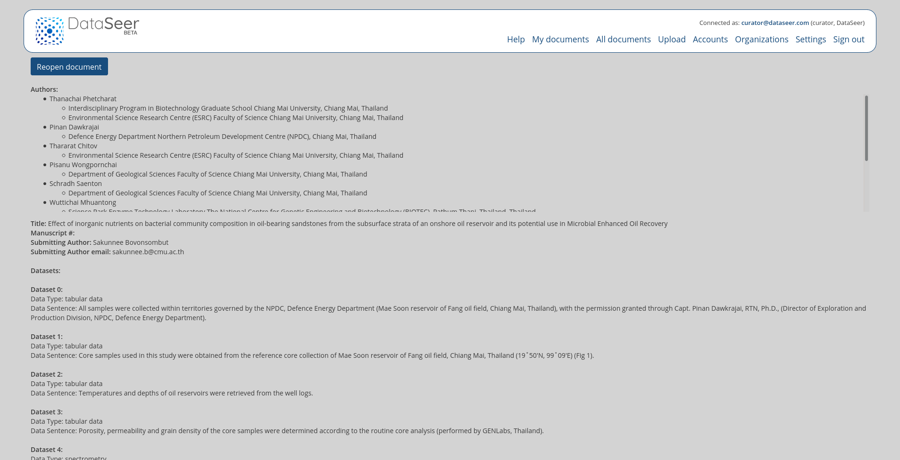

# DataSeer-Web


## Purposes

This repository corresponds to the DataSeer web application, which aims at driving the authors of scientific article/manuscripts to the best research data sharing practices, i.e. to ensure that the datasets coming with an article are associated with data availability statement, permanent identifiers and in general requirements regarding Open Science and reproducibility. 

Machine learning techniques are used to extract and structure the information of the scientific article, to identify contexts introducting datasets and finally to classify these context into predicted data types and subtypes. These ML predictions are used by the web application to help the authors to described in an efficient and assisted manner the datasets used in the article and how these data are shared with the scientific community. 

See the [dataseer-ml](https://github.com/dataseer/dataseer-ml) repository for the machine learning services used by DataSeer web.

Supported article formats are PDF, docx, TEI, JATS/NLM, ScholarOne, and a large variety of additional publisher native XML formats: BMJ, Elsevier staging format, OUP, PNAS, RSC, Sage, Wiley, etc (see [Pub2TEI](https://github.com/kermitt2/Pub2TEI) for the list of native publisher XML format covered).

## Install

``npm i``

## Run

``npm start``

To enable "demonstration mode" run:

On Linux/MacOS:

``DEMO=true npm start``

On Windows:

``set DEMO=true & npm start``

## Dependencies

Application need an instance of mongoDB running on port `27017`, with an `app` database (`conf/conf.json` to set complete URL).

## Description

The project provides: 

  - a web application to process documents stored in MongoDB database: `localhost:3000/`
  - a back office for uploading manually documents to be processed: `localhost:3000/backoffice/`
  - a REST api to load and modify documents data (CRUD): `localhost:3000/api`

##Documentations

  - [Web Application documentation](#web-application)
    - [Responses Status Codes](#routes)
    - [Credentials](#credentials)
    - [Results](#results)
    - [Routes](#routes)
  - [API documentation](#API)
    - [Responses Status Codes](##response-status-codes_1)
    - [Credentials](#credentials_1)
    - [Results](#results_1)
    - [Routes](#routes_1)
  
## Web Application

### Response status codes:

<table>
  <thead>
    <tr>
      <th>HTTP Status code</th>
      <th>Reason</th>
    </tr>
  </thead>
  <tbody>
    <tr>
      <td>200</td>
      <td>Successful operation</td>
    </tr>
    <tr>
      <td>401</td>
      <td>Access not granted</td>
    </tr>
    <tr>
      <td>404</td>
      <td>URL no found (route does not exist)</td>
    </tr>
    <tr>
      <td>500</td>
      <td>Internal service error</td>
    </tr>
  </tbody>
</table>

### Credentials

You must be logged (email & password) in to access most of the following routes.

Sign in (/signin) or Sign up (/signup) before using dataseer-web app.

__If you try to access an unauthorized route, the app will return an HTTP 401 error__

```
# HTTP 401 returned
Your current role do not grant access to this part of website
```

### Results

Web Application will return HTML Format response with HTTP 200.

### Routes

All these routes return a graphical interface (HTML format):

  - [/signup](#signup)
  - [/signin](#signin)
  - [/signout](#signout)
  - [/settings](#settings)
  - [/forgotPassword](#forgotPassword)
  - [/resetPassword](#resetPassword)
  - [/myDocuments](#myDocuments)
  - [/documents/:id](#documentsid)
  - [/upload](#upload)
  - [/documents](#documents)
  - [/accounts](#accounts)
  - [/organizations](#organizations)

---

#### /signup

##### Role required

This route is public.

##### GUI

Use it to sign up to dataseer-web service.


---

#### /signin

##### Role required

This route is public.

##### Purpose

Use it to sign in to dataseer-web service.


---

#### /signout

##### Role required

Accessible to users with the following role : **santard_user**, **annotator**, **curator**.

##### Purpose

Use it to sign out to dataseer-web service.

---

#### /settings

##### Role required

Accessible to users with the following role : **santard_user**, **annotator**, **curator**.

##### Purpose

Use it to reset your password (when you are logged in) or get your account infos.


---

#### /forgotPassword

##### Role required

Accessible to users with the following role : **santard_user**, **annotator**, **curator**.

##### Purpose

Use it to get your password reset email when you are logged out.

*(An email containing all required informations will be sent to you)*


---

#### /resetPassword

##### Role required

Accessible to users with the following role : **santard_user**, **annotator**, **curator**.

##### Purpose

Use it to reset your password when you are logged out.

*(An email containing all required informations should have been sent to you)*


---

#### /myDocuments

##### Role required

Accessible to users with the following role : **santard_user**, **annotator**, **curator**.

##### Purpose

Use it to get your documents.


---

#### /documents/:id

##### Role required

Accessible to users with the following role : **santard_user**, **annotator**, **curator**.

##### Purpose

Use it to get process a given document.

There is 3 steps while processing document:

###### metadata: metadata validation.


###### datasets: data entry of datasets.
  


###### finish: report of data entered.



Note: **santard_user**, **annotator**, **curator** do not have same restrictions & features available.

---

#### /upload

##### Role required

Accessible to users with the following role : **santard_user**, **annotator**, **curator**.

##### Purpose

Use it to upload a given document as **standard_user** or **annotator** (multiple documents if you are **curator**).

###### standard_user GUI


###### annotator & curator GUI


Note: **santard_user** or **annotator** will be redirected to uploaded document ("metadata" step), **curator** will get a report of all uploaded files.

---

#### /documents

##### Role required

Accessible to users with the following role : **annotator**, **curator**.

##### Purpose

Use it to get all documents.


Note: **annotator** can only see documents of his organization, **curator** see all documents of all organizations.

---

#### /accounts

##### Role required

Accessible to users with the following role : **curator**.

##### Purpose

Use it to manage all accounts.


---

#### /organizations

##### Role required

Accessible to users with the following role : **curator**.

##### Purpose

Use it to manage all organizations.


---

## API

### Response status codes:

<table>
  <thead>
    <tr>
      <th>HTTP Status code</th>
      <th>Reason</th>
    </tr>
  </thead>
  <tbody>
    <tr>
      <td>200</td>
      <td>Successful operation</td>
    </tr>
    <tr>
      <td>401</td>
      <td>Access not granted</td>
    </tr>
    <tr>
      <td>404</td>
      <td>URL no found (route does not exist)</td>
    </tr>
    <tr>
      <td>500</td>
      <td>Internal service error</td>
    </tr>
  </tbody>
</table>

### Credentials

You must use your API token to access all of the following routes.

Set your token into HTTP headers (Authorization: Bearer my).

```
# Replace MY_TOKEN by your dataseer-web API token
# use -H 'Authorization: Bearer MY_TOKEN' to set headers with curl
$ curl 'http://localhost:3000/api/documents/5ffa06e61c157616a5c6bae7' -H 'Authorization: Bearer MY_TOKEN'
```

__If you try to access an unauthorized route, the app will return an HTTP 401 error__

```
# HTTP 401 will be returned
$ curl 'http://localhost:3000/documents/5ffa06e61c157616a5c6bae7' -H 'Authorization: Bearer MY_TOKEN'
Your current role do not grant access to this part of website
```

### Results

API will return JSON object response with HTTP 200.

Documents returned by API are structured like:

```js
{
  "_id": String,
  "pdf": {
    "id": String,
    "metadata": {
      "sentences": {
        "chunks": [
          {
            "index": 0,
            "p": String,
            "x": String,
            "y": String,
            "w": String,
            "h": String,
            "sentenceId": Number
          }
        ],
        "mapping": {
          "0": [ Number ]
        }
      },
      "filename": String
    },
    "data": Buffer // or undefined
  },
  "uploaded_at": Date,
  "modifiedBy": {
    "standard_user": {},
    "annotator": {},
    "curator": {}
  },
  "organisation": String,
  "metadata": {
    "articleTitle": String,
    "journal": String,
    "publisher": String,
    "date_published": String,
    "manuscriptId": String,
    "submittingAuthor": String,
    "submittingAuthorEmail": String,
    "authors": [
      {
        "name": String,
        "affiliations": [String]
      }
    ],
    "doi": String,
    "pmid": String
  },
  "datasets": {
    "deleted": [Object],
    "extracted": {
      "dataset-1": {
        "id": String,
        "sentenceId": String,
        "cert": String,
        "dataType": String,
        "subType": String,
        "description": String,
        "bestDataFormatForSharing": String,
        "mostSuitableRepositories": String,
        "DOI": String,
        "name": String,
        "comments": String,
        "text": String,
        "status": String
      }
    },
    "current": {
      "dataset-1": Object
  },
  "status": String,
  "source": "<!--?xml version=\"1.0\" encoding=\"UTF-8\"?--><tei>[...]</tei>",
  "updated_at": Date,
  "__v": 0
}
```

#### Success

In case of success, API will return this kind of object:

```js
{
  "err": false,
  "res": {...}
}
// OR
{
  "err": false,
  "res": [{...}]
}
```

#### Error

```js
{
  "err": true,
  "res": null,
  "msg": "A human-readable message describing the error that occurred"
}
```

<table>
  <thead>
    <tr>
      <th>Error message</th>
      <th>Description</th>
    </tr>
  </thead>
  <tbody>
    <tr>
      <td>API unable to validate token</td>
      <td>Token authentication not available (API not configured to handle token)</td>
    </tr>
    <tr>
      <td>TokenExpiredError: jwt expired</td>
      <td>Token is no longer valid</td>
    </tr>
  </tbody>
</table>
 
### Routes

All these routes return a JSON object:

  - [(GET) /api/documents](#get-apidocuments)
  - [(GET) /api/documents/:id](#get-apidocumentsid)

---

#### (GET) /api/documents

##### Role required

Accessible to users with the following role : **santard_user**, **annotator**, **curator**.

##### Parameters

<table>
  <thead>
    <tr>
      <th>Method</th>
      <th>Request type</th>
      <th>Response type</th>
      <th>Parameters</th>
      <th>Requirement</th>
      <th>Description</th>
    </tr>
  </thead>
  <tbody>
    <tr>
      <td>GET</td>
      <td>application/x-www-form-urlencoded</td>
      <td>application/json</td>
      <td>limit</td>
      <td>optional</td>
      <td>Maximum number of returned results</td>
    </tr>
    <tr>
      <td>GET</td>
      <td>application/x-www-form-urlencoded</td>
      <td>application/json</td>
      <td>doi</td>
      <td>optional</td>
      <td>The desired DOI</td>
    </tr>
    <tr>
      <td>GET</td>
      <td>application/x-www-form-urlencoded</td>
      <td>application/json</td>
      <td>pmid</td>
      <td>optional</td>
      <td>The desired PMID</td>
    </tr>
  </tbody>
</table>

##### How to request

```bash
# Will return 30 first documents
curl 'http://localhost:3000/api/documents?limit=30'
# Will return documents with DOI 'doi:10.1038/nphys1170'
curl 'http://localhost:3000/api/documents?doi=doi:10.1038/nphys1170'
# Will return documents with DOI '18183754'
curl 'http://localhost:3000/api/documents?pmid=18183754'
```

##### Result

```js
{
  "err": false,
  "res": [{...}, {...}] // Array of documents
}
```

---

#### (GET) /api/documents/:id

##### Role required

Accessible to users with the following role : **santard_user**, **annotator**, **curator**.

##### Parameters

<table>
  <thead>
    <tr>
      <th>Method</th>
      <th>request type</th>
      <th>response type</th>
      <th>parameters</th>
      <th>requirement</th>
      <th>description</th>
    </tr>
  </thead>
  <tbody>
    <tr>
      <td>GET</td>
      <td>application/x-www-form-urlencoded</td>
      <td>application/json</td>
      <td>pdf</td>
      <td>optional</td>
      <td>Specifies whether the PDF file is returned (not returned by default)</td>
    </tr>
  </tbody>
</table>

##### How to request

```bash
# Will return document with ID 602bd8dedcae9448ab0f0bdd without PDF file
# res.pdf.data key will not be set
curl 'http://localhost:3000/api/documents/602bd8dedcae9448ab0f0bdd'
# Will return document with ID 602bd8dedcae9448ab0f0bdd with PDF file
# Buffer of PDF file will be set in res.pdf.data
curl 'http://localhost:3000/api/documents/602bd8dedcae9448ab0f0bdd?pdf=true'
```

##### Result

```js
{
  "err": false,
  "res": {...} // given document
}
```

---

## Implementation

MongoDB stores every documents.

Express is used as web framework.

## Contact and License

Main authors and contact: Nicolas Kieffer, Patrice Lopez (<patrice.lopez@science-miner.com>).

The development of dataseer-ml is supported by a [Sloan Foundation](https://sloan.org/) grant, see [here](https://coko.foundation/coko-receives-sloan-foundation-grant-to-build-dataseer-a-missing-piece-in-the-data-sharing-puzzle/).

dataseer-Web is distributed under [Apache2 license](https://www.apache.org/licenses/LICENSE-2.0).
