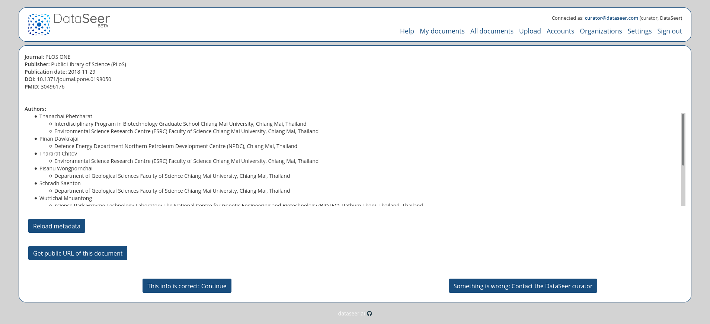
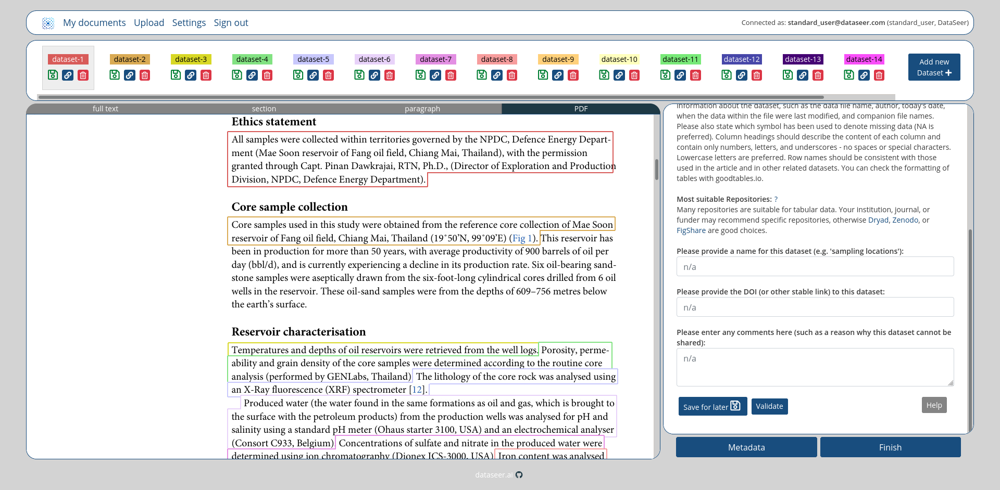
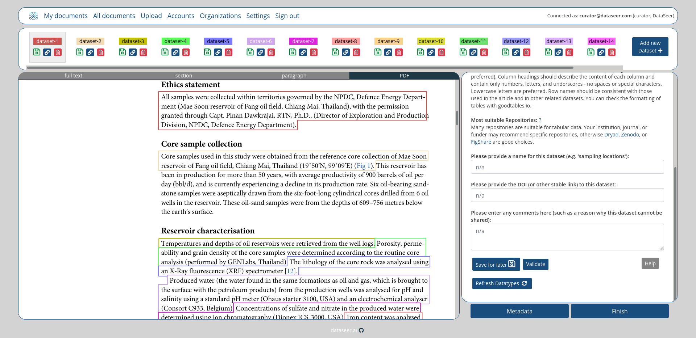

# Web Application documentation

*[Main Documentation](../README.md#documentations)*

  - [Responses Status Codes](#response-status-codes)
  - [Credentials](#credentials)
  - [Results](#results)
  - [Available Routes](#available-routes)
    - [/signup](#signup)
    - [/signin](#signin)
    - [/signout](#signout)
    - [/settings](#settings)
    - [/forgotPassword](#forgotpassword)
    - [/resetPassword](#resetpassword)
    - [/myDocuments](#mydocuments)
    - [/documents/:id](#documentsid)
    - [/upload](#upload)
    - [/documents](#documents)
    - [/accounts](#accounts)
    - [/organizations](#organizations)

## Response status codes:

*[Table of contents](#web-application-documentation)*

<table>
  <thead>
    <tr>
      <th>HTTP Status code</th>
      <th>Reason</th>
    </tr>
  </thead>
  <tbody>
    <tr>
      <td>200</td>
      <td>Successful operation</td>
    </tr>
    <tr>
      <td>401</td>
      <td>Access not granted</td>
    </tr>
    <tr>
      <td>404</td>
      <td>URL no found (route does not exist)</td>
    </tr>
    <tr>
      <td>500</td>
      <td>Internal service error</td>
    </tr>
  </tbody>
</table>

## Credentials

*[Table of contents](#web-application-documentation)*

You must be logged (email & password) in to access most of the following routes.

Sign in (/signin) or Sign up (/signup) before using dataseer-web app.

__If you try to access an unauthorized route, the app will return an HTTP 401 error__

```
 HTTP 401 returned
Your current role do not grant access to this part of website
```

## Results

*[Table of contents](#web-application-documentation)*

Web Application will return HTML Format response with HTTP 200.

## Available Routes

*[Table of contents](#web-application-documentation)*

All these routes return a graphical interface (HTML format):

  - [/signup](#signup)
  - [/signin](#signin)
  - [/signout](#signout)
  - [/settings](#settings)
  - [/forgotPassword](#forgotpassword)
  - [/resetPassword](#resetpassword)
  - [/myDocuments](#mydocuments)
  - [/documents/:id](#documentsid)
  - [/upload](#upload)
  - [/documents](#documents)
  - [/accounts](#accounts)
  - [/organizations](#organizations)

---

### /signup

*[Available Routes](#available-routes)*

#### Role required

This route is public.

#### GUI

Use it to sign up to dataseer-web service.


---

### /signin

*[Available Routes](#available-routes)*

#### Role required

This route is public.

#### Purpose

Use it to sign in to dataseer-web service.


---

### /signout

*[Available Routes](#available-routes)*

#### Role required

Accessible to users with the following role : **santard_user**, **annotator**, **curator**.

#### Purpose

Use it to sign out to dataseer-web service.

---

### /settings

*[Available Routes](#available-routes)*

#### Role required

Accessible to users with the following role : **santard_user**, **annotator**, **curator**.

#### Purpose

Use it to reset your password (when you are logged in) or get your account infos.


---

### /forgotPassword

*[Available Routes](#available-routes)*

#### Role required

Accessible to users with the following role : **santard_user**, **annotator**, **curator**.

#### Purpose

Use it to get your password reset email when you are logged out.

*(An email containing all required informations will be sent to you)*


---

### /resetPassword

*[Available Routes](#available-routes)*

#### Role required

Accessible to users with the following role : **santard_user**, **annotator**, **curator**.

#### Purpose

Use it to reset your password when you are logged out.

*(An email containing all required informations should have been sent to you)*


---

### /myDocuments

*[Available Routes](#available-routes)*

#### Role required

Accessible to users with the following role : **santard_user**, **annotator**, **curator**.

#### Purpose

Use it to get your documents.


---

### /documents/:id

*[Available Routes](#available-routes)*

#### Role required

Accessible to users with the following role : **santard_user**, **annotator**, **curator**.

Note: **santard_user**, **annotator**, **curator** do not have same restrictions & features available.

#### Purpose

Use it to get process a given document.

There is 3 steps while processing document:

---

##### metadata: metadata validation.

*[Available Routes](#available-routes)*

**santard_user**

On "metadata" step, you can validate metadata with button "Continue" to go to the next step (or contact a curator if nedded).

You can also share this document with button "Get public URL of this document". By using this URL, You will be considered as a "visitor" (a standard_user not logged in).

__Note:__ Public URL is like `http://localhost:3000/documents/60479f995e905b3e479e02e1?documentToken=...`


**annotator**, **curator**.

As curator or annotator, you can also reload metadata (useful after dataseer-ml service update/upgrade).



---

##### datasets: data entry of datasets.

*[Available Routes](#available-routes)*

On "datasets" step, PDF (or XML) is displayed in the GUI to enter the data relating to each datasets.

**santard_user**

Available actions:

  - "Add new Dataset" (you need to select sentence before)
  - "Delete" a given Dataset (click on trash icon)
  - "Link" sentence to an existing Dataset (click on trash icon of a Dataset)
  - "Save for later" a Dataset (click on chain icon of a Datset)
  - "Validate" a Dataset ("Name" & "DOI" are required)
  - "Metadata" Go back to "metadata" step
  - "Finish" Go to "finish" step (all Datasets must be validated)



**annotator**, **curator**.

Available actions:

  - Same **santard_user** actions
  - "Refresh Datatypes" (useful after dataseer-ml service update/upgrade)
  - "Finish" Go to "finish" step without validate all Datasets



**Using public URL**

Same as **santard_user** (but you will be not considered as logged in).


---

##### finish: report of data entered.

*[Available Routes](#available-routes)*

Accessible to users with the following role : **santard_user**, **annotator**, **curator**.

On "finish" step, summary of current state of document is shown. You can "Reopen document" to go back to "metadata" step and restart the process.


---

### /upload

*[Available Routes](#available-routes)*

#### Role required

Accessible to users with the following role : **santard_user**, **annotator**, **curator**.

#### Purpose

Use it to upload a given document as **standard_user** or **annotator** (multiple documents if you are **curator**).

##### standard_user GUI


##### annotator & curator GUI


Note: **santard_user** or **annotator** will be redirected to uploaded document ("metadata" step), **curator** will get a report of all uploaded files.

---

### /documents

*[Available Routes](#available-routes)*

#### Role required

Accessible to users with the following role : **annotator**, **curator**.

#### Purpose

Use it to get all documents.


Note: **annotator** can only see documents of his organization, **curator** see all documents of all organizations.

---

### /accounts

*[Available Routes](#available-routes)*

#### Role required

Accessible to users with the following role : **curator**.

#### Purpose

Use it to manage all accounts.

Use "New Token" button to send email (containing the token) to the user.


---

### /organizations

*[Available Routes](#available-routes)*

#### Role required

Accessible to users with the following role : **curator**.

#### Purpose

Use it to manage all organizations.


---